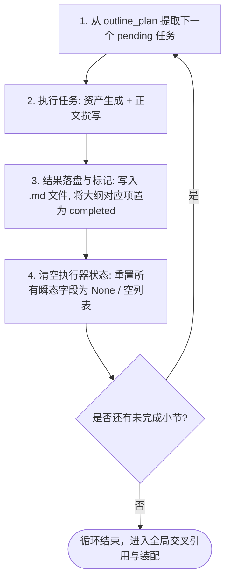

# 全局状态机 State 数据结构规范 (01-state-spec)

本文档定义基于 LangGraph 的高校毕业论文生成系统的状态机设计规范，涵盖**全局共享状态（`PaperGlobalState`）**、**各智能体私有状态（Agent State）**以及**执行智能体的循环与瞬态清空机制**。

---

## 1. 全局共享状态 (`PaperGlobalState`)

`PaperGlobalState` 贯穿整个工作流生命周期，仅维护系统级核心路径、跨智能体共享的底层事实资产，严禁容纳单步临时变量。

```python
from typing import TypedDict, List, Dict, Any, Optional

class PaperGlobalState(TypedDict):
    """
    系统全局共享状态
    【设计原则】只保留具备全局、跨阶段持久价值的基础设施路径与核心事实资产。
    """
    # 1. 基础配置与目录
    raw_doc_path: str                 # 1. 原文档/学校模板地址 (.docx)
    new_template_path: str            # 2. 新模板的文件地址（提取并标准化后的模板）
    workspace_dir: str                # 3. 本次任务工作区根目录（所有生成产物落盘位置）

    # 2. 核心学术资产与唯一事实源
    single_source_of_truth: Dict[str, Any]  # 唯一事实源（技术栈、数据库实体Schema、功能设计、实验方法）
    bib_pool: List[Dict[str, Any]]          # 文献池（20-25篇真实中英文献元数据及引用 Key）

    # 3. 项目元信息
    project_id: str                   # 项目唯一标识
    topic: str                        # 论文题目
```

---

## 2. 各智能体专有状态定义

系统采用清晰的职责分离架构，每个智能体仅读写其职责范围内的状态。

### 2.1 Agent 1：文档格式提取智能体 (`FormatExtractorState`)

- **职责**：解析用户上传的原始学校格式模板，抽取内置排版样式规范，清洗生成新的标准模板供后续 Agent 参考。
- **状态设计**：
  - `template`：解析出的规范化新模板对象/路径与内置样式配置字典。

```python
import operator
from typing import Annotated, TypedDict, List, Dict, Any

class FormatExtractorState(TypedDict):
    """
    Agent 1 专有状态：文档格式提取
    """

    # 提炼出的模板与内置样式，供后续 Agent 直接参考
    template: Dict[str, Any]
    # template 结构示例：
    # {
    #     "template_path": "workspace/template/working_template.docx",
    #     "styles": {
    #         "heading_1": {"font": "黑体", "size_pt": 16, "bold": True, "align": "center"},
    #         "heading_2": {"font": "黑体", "size_pt": 14, "bold": True, "align": "left"},
    #         "heading_3": {"font": "宋体", "size_pt": 12, "bold": True, "align": "left"},
    #         "body": {"font": "宋体", "size_pt": 12, "line_spacing": 1.5, "indent_chars": 2}
    #     }
    # }
```

---

### 2.2 Agent 2：大纲与全局规划智能体 (`GlobalPlannerState`)

- **职责**：前置确立全书唯一的底层事实（唯一事实源），并制定精细到二级小节的撰写规划（包含明确的图表资产埋点需求）。
- **状态设计**：
  - `single_source_of_truth`：技术栈、实体 Schema、功能设计、实验方法等全局核心指标。
  - `outline_plan`：二级标题撰写计划列表（明确标注 `planned_assets` 需求）。

```python
class SectionPlan(TypedDict):
    """二级标题单节规划"""
    section_id: str                   # 小节序号，如 "3.2", "4.3"
    title: str                        # 小节标题，如 "4.3 数据库详细设计"
    target_words: int                 # 目标字数，如 1200
    status: str                       # 状态: "pending" | "in_progress" | "completed"
    planned_assets: List[str]         # 明确规划的图表资产清单

class GlobalPlannerState(TypedDict):
    """
    Agent 2 专有状态：大纲与全局规划
    """
    # 1. 唯一事实源 (Single Source of Truth)
    single_source_of_truth: Dict[str, Any]
    # 结构示例：
    # {
    #     "tech_stack": {"backend": "Spring Boot 3", "frontend": "Vue 3", "db": "MySQL 8.0"},
    #     "db_schemas": {
    #         "t_user": {"pk": "id", "fields": ["id", "username", "password_hash", "role"]},
    #         "t_appointment": {"pk": "id", "fields": ["id", "user_id", "counselor_id", "status"]}
    #     },
    #     "functional_modules": ["用户认证", "心理测评", "在线预约", "咨询记录管理"],
    #     "experiment_methods": "系统压力测试与问卷调查分析法"
    # }

    # 2. 二级标题大纲规划计划列表
    outline_plan: List[SectionPlan]
    # 规划中各节 planned_assets 示例：
    # [
    #     {"section_id": "3.2", "title": "业务流程分析", "status": "pending", "planned_assets": ["fig_3_1 (时序图)"]},
    #     {"section_id": "4.1", "title": "系统总体架构", "status": "pending", "planned_assets": ["fig_4_1 (架构图)"]},
    #     {"section_id": "4.3", "title": "数据库设计", "status": "pending", "planned_assets": ["tbl_4_1 (三线表)"]},
    #     {"section_id": "5.2", "title": "预约功能实现", "status": "pending", "planned_assets": ["ui_5_1 (UI截图)", "ui_5_2 (UI截图)"]},
    #     {"section_id": "6.2", "title": "核心功能测试", "status": "pending", "planned_assets": ["tbl_6_1 (测试用例)"]}
    # ]
```

---

### 2.3 Agent 3：文献索引智能体 (`LiteratureIndexerState`)

- **职责**：介于大纲规划与正文执行之间，根据题目与全局唯一事实源，检索/匹配真实文献，构建标准化文献池。
- **状态设计**：专有状态极简，**仅包含文献池（`bib_pool`）**。

```python
class LiteratureIndexerState(TypedDict):
    """
    Agent 3 专有状态：文献索引智能体
    【设计原则】状态极简，仅维护检索匹配后的规范化文献池。
    """
    bib_pool: List[Dict[str, Any]]
    # 文献条目结构示例：
    # [
    #     {
    #         "key": "cite_spring_security",
    #         "authors": "Johnson R, Hoeller J",
    #         "title": "Enterprise Security Architecture with Spring",
    #         "journal": "IEEE Software",
    #         "year": 2023,
    #         "doi": "10.1109/MS.2023.01"
    #     }
    # ]
```

---

## 3. 执行智能体循环与状态清空机制 (`SectionExecutor`)

执行智能体按照 `outline_plan` 顺序逐节撰写。为防止多轮循环导致 Token 上下文膨胀、内存泄漏和幻觉污染，**核心原则是“瞬态即焚”：每完成一个小节任务，必须彻底清空执行智能体的相关私有状态，绝不跨轮保留**。

### 3.1 瞬态私有状态定义 (`SectionExecutorState`)

```python
class SectionExecutorState(TypedDict):
    """
    执行智能体单步瞬态状态（仅在单节任务执行期间存活）
    """
    current_task: Optional[SectionPlan]        # 当前领取的单节计划
    generated_assets: List[Dict[str, Any]]     # 当前小节内生成的图表资产（图片路径/三线表数据）
    draft_content: Optional[str]               # 当前小节生成出的正文 Markdown 文本
    prompt_context: Optional[str]              # 当前小节组装的临时 Prompt 上下文
```

### 3.2 循环执行与状态清空协议 (Reset Protocol)

在 LangGraph 或调度驱动循环中，每次循环由以下 4 步构成：



#### 代码实现清空范式（LangGraph 节点返回清空）

```python
def section_executor_node(state: Dict[str, Any]) -> Dict[str, Any]:
    """
    执行智能体节点处理逻辑
    """
    current_task = get_next_pending_task(state["outline_plan"])
    if not current_task:
        return {}

    # 1. 资产先导生成 (根据 current_task["planned_assets"])
    step_assets = generate_planned_assets(current_task["planned_assets"], state["single_source_of_truth"])

    # 2. 单节正文起草 (结合唯一事实源、文献池锚点)
    section_text = write_section_content(
        task=current_task,
        ssot=state["single_source_of_truth"],
        bib_pool=state["bib_pool"],
        assets=step_assets
    )

    # 3. 产物立即落盘保存到工作区，不堆积在全局内存中
    save_section_to_workspace(
        workspace_dir=state["workspace_dir"],
        section_id=current_task["section_id"],
        content=section_text,
        assets=step_assets
    )

    # 4. 更新大纲状态为已完成
    updated_outline = mark_task_completed(state["outline_plan"], current_task["section_id"])

    # 5. 【关键清空步骤】返回清空后的瞬态状态，不进行任何保留！
    return {
        "outline_plan": updated_outline,
        # 显式重置执行器的临时变量，杜绝历史状态污染下一次循环
        "current_task": None,
        "generated_assets": [],
        "draft_content": None,
        "prompt_context": None
    }
```

---

## 4. 状态读写矩阵 (CRUD Matrix)

下表总结全流程各节点对核心状态的操作关系：

| 状态字段 | 所属类别 | Agent 1 (格式提取) | Agent 2 (全局规划) | Agent 3 (文献索引) | 执行智能体 (小节循环) | 后续装配节点 |
| :--- | :--- | :---: | :---: | :---: | :---: | :---: |
| `raw_doc_path` | 全局路径 | **读取** | - | - | - | - |
| `new_template_path` | 全局路径 | **写入** | - | - | - | **读取** |
| `workspace_dir` | 全局路径 | **读取** | **读取** | **读取** | **读取 (产物落盘)** | **读取** |
| `single_source_of_truth` | 核心事实 | - | **写入** | **读取** | **读取 (防矛盾)** | - |
| `bib_pool` | 学术资产 | - | - | **写入** | **读取 (引用锚点)** | **读取 (文献重排)** |
| `FormatExtractorState.content` | 私有追加 | **追加** | - | - | - | - |
| `FormatExtractorState.template`| 样式对象 | **写入** | - | - | **读取 (参照)** | **读取** |
| `GlobalPlannerState.outline_plan` | 任务矩阵 | - | **写入** | - | **读取并更新状态** | **读取 (装配顺序)** |
| `SectionExecutorState.*` | 瞬态私有 | - | - | - | **每轮写入并清空** | - |
